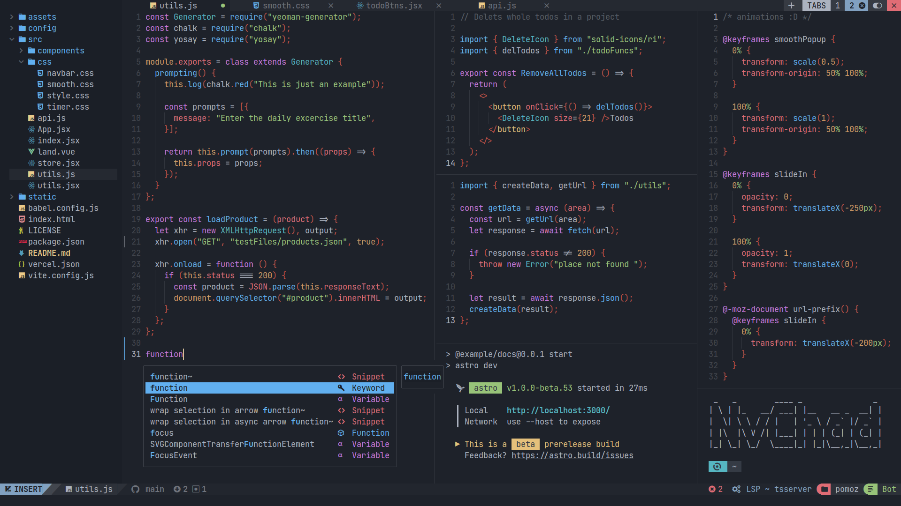
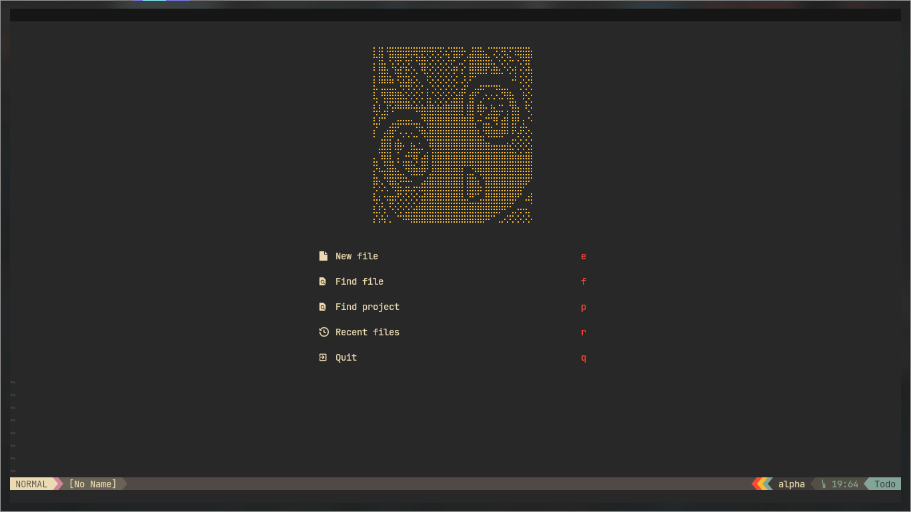

# My custom Config to Nvim

I made my own config, requested to my girlfriend... i prefer to use to use
[NvChad](https://nvchad.com/)

But, when i made it, i learn more about lua and nvim config...
 
